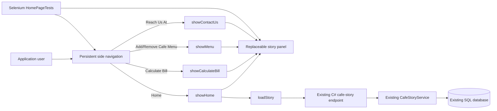
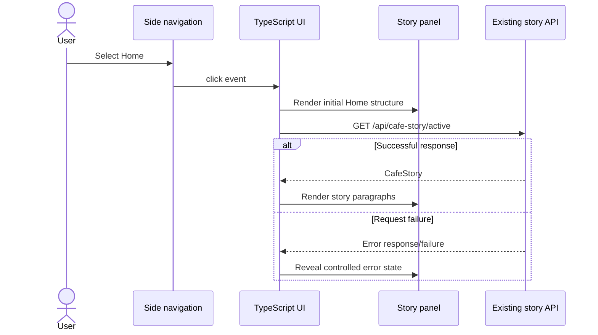

# System Architecture: US-005

## 1. Source and Summary
- User story reference: US-005, Implementation of UI Changes on Home Page
- Source requirement analysis document: `UserStories/US-005/US-005-RequirementAnalysis.md`
- Solution summary: Update the persistent side navigation, preserve the existing contact renderer, and add a client-side Home renderer that restores the initial cafe-story panel after any other view replaces it.
- Actors and stakeholders: Cafe application users, cafe operators, application maintainers, and Selenium test maintainers.
- Architecture objective: Deliver the requested navigation changes with minimal impact, no backend or database changes, stable accessibility semantics, and testable restoration of the home content.

## 2. Scope

### In scope
- Replace the static `Explore` label with an internal `Home` anchor.
- Rename the visible `Contact Us` text to `Reach Us At` while preserving its selector, target, and renderer.
- Remove the external locate anchor from the navigation DOM.
- Add client-side Home rendering and cafe-story loading after other views have replaced the story panel.
- Preserve the current visual language and responsive layout.
- Update focused Selenium coverage for labels, destinations, absence, restoration, and repeated navigation.
- Regenerate the compiled browser JavaScript from the TypeScript source.

### Out of scope
- C# endpoint, service, model, middleware, authentication, or authorization changes.
- SQL schema, query, migration, transaction, or seed-data changes.
- Client-side routing framework adoption.
- Browser History API integration, Back/Forward view routing, or deep-link restoration.
- Reintroducing or replacing the removed Locate Us capability.
- Redesigning the home page, contact content, menu, or bill workflow.

### Assumptions and constraints
- The existing `/api/cafe-story/active` endpoint remains the authoritative source for home story content.
- The navigation remains outside `.story-panel`, so replacing panel contents does not replace navigation anchors or their event handlers.
- TypeScript in `src/CafeManagement/src/main.ts` is the browser-logic source; `wwwroot/main.js` is generated by the existing `npm run build` command.
- Home restoration reuses the current story-loading success and error behavior.
- The current desktop layout and the existing `max-width: 700px` responsive breakpoint are the supported layout surfaces unless a later requirement defines others.

## 3. High-Level Architecture

### Architectural style
Retain the existing .NET-hosted static single-page shell with lightweight TypeScript view rendering. No router or additional dependency is introduced.

### Presentation layer
- `wwwroot/index.html` owns the persistent header, side navigation, and initial home panel markup.
- `src/main.ts` owns navigation event handling and dynamic rendering into `.story-panel`.
- `wwwroot/styles.css` owns existing navigation, focus, panel, and responsive styles.
- `wwwroot/main.js` is generated from `src/main.ts` for browser execution.

### Application/service layer
The existing C# cafe-story endpoint and service remain unchanged. The UI calls the same endpoint when loading or restoring Home.

### Data access layer
No changes. Existing cafe-story data access continues to serve the active story.

### Database layer
No changes. US-005 neither creates nor modifies persisted data.

### External integrations
The Locate Us external integration is removed from the navigation. Existing Facebook and Instagram links in the contact view remain unchanged.

## 4. Component Diagram

### Component responsibilities
- **Persistent side navigation:** Exposes Home, Calculate Bill, Add/Remove Cafe Menu, and Reach Us At anchors. It contains no Locate Us element.
- **Home renderer:** Recreates the initial home heading, story-content region, loading state, and hidden error region in `.story-panel`.
- **Story loader:** Fetches the active story and renders success or controlled failure into elements belonging to the current Home view.
- **Existing view renderers:** Continue to own bill, menu, and contact contents without behavioral changes.
- **Selenium layer:** Verifies DOM labels and absence, link operation, restored content, and unaffected navigation behavior.

## 5. Data Flow

### Initial home request flow
1. The browser loads `index.html`, which contains the persistent navigation and initial Home panel.
2. Compiled `main.js` attaches one click handler to each internal navigation anchor.
3. `loadStory` requests `/api/cafe-story/active` and targets the current Home content and error elements.
4. The existing C# endpoint and service return the active cafe story.
5. The loader renders story paragraphs or reveals the existing controlled error message.

### Home restoration flow
1. The user selects `Home` while any client-rendered view is displayed.
2. The handler prevents default fragment-only behavior and invokes `showHome`.
3. `showHome` replaces `.story-panel` contents with the initial Home structure and loading state.
4. `showHome` invokes `loadStory` against the newly created Home elements.
5. The active story or controlled error state is rendered without replacing the persistent navigation.

### Contact flow
The existing contact anchor keeps its stable selector and `#contact-us` target. Its visible label changes to `Reach Us At`, and its existing click handler continues to invoke `showContactUs`.

### Persistence flow
None. Navigation state and rendered view state are transient browser state, and US-005 introduces no writes.

### Error and exception flow
- Story request failures render the existing Home error state.
- `showHome` shall pass its newly rendered story-content and story-error elements to `loadStory`; the loader shall not retain module-level references to replaceable panel children.
- Before applying an asynchronous success or failure result, `loadStory` shall verify that its view-scoped elements remain connected to the active `.story-panel`. A response from an abandoned Home render shall not alter a later view.
- Existing menu, bill, and contact error behavior remains unchanged.

### Validation flow
Static markup establishes correct link text, href values, test identifiers, and removal of Locate Us. Selenium verifies runtime rendering and repeated transitions among views.

## 6. C# Backend Design

### Controllers and endpoints
No changes. Continue using the existing active cafe-story read endpoint.

### Service responsibilities and domain logic
No changes. `CafeStoryService` remains responsible for retrieving the active story; navigation and panel restoration remain presentation concerns.

### DTOs and request-response models
No changes to `CafeStory` or any request/response contract.

### Validation and error handling
No new server-side validation is required. Existing non-success responses remain inputs to the current controlled UI error state.

### Authentication and authorization
No new implications are introduced. US-005 does not add protected operations or alter endpoint access.

### Logging and observability
No changes. Existing backend logging behavior remains in place; the UI shall not log or expose additional data.

## 7. SQL Database Design

### Tables and entities
No changes. Existing cafe-story records continue to supply Home content.

### Relationships, keys, constraints, and indexes
No changes.

### Transactions and concurrency
Not applicable because US-005 performs no database writes.

### Audit and history
Not applicable because navigation changes create no persisted business event.

## 8. Selenium UI Testing Design

### Test coverage scope
- Assert `Home` and `Reach Us At` visible labels through stable `data-testid` selectors.
- Assert that `Explore`, `Contact Us`, and the locate selector/anchor are absent as applicable.
- Preserve assertions for the contact href, contact details, and safe social links.
- Navigate from Calculate Bill, Add/Remove Cafe Menu, and Reach Us At back to Home and await loaded story content.
- Verify Home restoration from nested client-rendered states, including the Add Menu form and final bill, when their existing deterministic setup data is available.
- Repeat transitions to detect stale DOM references, duplicate handlers, or unresponsive links.
- Verify link count and explicit identities rather than relying only on DOM order.

### Critical user journeys
1. Initial load displays the Home link and active story.
2. Reach Us At displays the existing contact content.
3. Each non-home view returns to loaded Home content through the Home link.
4. All retained navigation links still open their intended views after repeated transitions.

### Positive, negative, and boundary scenarios
- Positive: Every retained link is visible, keyboard-operable by native anchor semantics, and displays its intended content.
- Negative: Locate Us and old labels are not found in the navigation DOM.
- Negative: A failed cafe-story request after Home selection shows the existing controlled error state when the test environment provides a deterministic failure setup; otherwise, report this scenario as unexecuted rather than passing it without evidence.
- Boundary: Repeated Home selections and repeated cross-view navigation do not duplicate content or disable handlers.
- Responsive: Retain desktop `1440x900` execution and add a mandatory narrow viewport check at 700 pixels or below. Assert that retained navigation links are displayed, their rectangles remain within the viewport, navigation text is not clipped, and the stacked navigation and content regions do not overlap.

### Test data needs
- Existing deterministic active cafe-story fixture or local database data.
- Existing menu and bill data only where needed to open those views; US-005 does not add test data.
- A deterministic way to make the active cafe-story request fail is required before the Selenium failure scenario can produce valid evidence.

### Selector and testability considerations
- Add `data-testid="nav-home"` to Home.
- Retain `data-testid="nav-contact"` for Reach Us At.
- Retain current `nav-menu`, `nav-calculate-bill`, `story-content`, `story-error`, and contact selectors.
- Assert absence through `FindElements`, avoiding exceptions as the assertion mechanism.
- Avoid selectors based on anchor index, CSS presentation classes, or label text alone.

### Cross-browser and execution considerations
The existing suite uses headless Chrome. Cross-browser execution is not required by US-005 and remains an open quality enhancement rather than an implementation dependency.

## 9. Non-Functional Considerations
- Preserve current colors, typography, spacing, focus treatment, and responsive side-panel behavior.
- Use native anchors for Home and retained navigation so keyboard operation and accessible naming require no custom key handling.
- Keep navigation event listeners attached once to persistent elements; do not attach them inside view renderers.
- Keep the Home renderer small and deterministic, with no new framework or runtime dependency.
- Ensure asynchronous story results target the Home elements created for that render and do not overwrite a later non-home view.
- Compile TypeScript with the existing project configuration and validate the focused Selenium suite against a running application.

## 10. Risks, Dependencies, and Open Questions

### Confirmed facts
- Other client-side views replace `.story-panel` contents.
- Current story-content and story-error references are captured only from the initial DOM.
- Navigation is persistent outside `.story-panel`.
- The contact flow is already selected through `data-testid="nav-contact"` and rendered by `showContactUs`.
- The current Selenium test expects four navigation anchors; replacing Explore with Home while removing Locate Us keeps the total at four.

### Assumptions
- Home restoration may issue a new active-story request each time, matching the initial loading and error behavior.
- `#home` is an acceptable internal anchor target even though browser history behavior is not implemented.
- The current CSS link rules provide the baseline Home style; any additional class is limited to preserving the former label's visual hierarchy.

### Dependencies
- Existing index shell and side-panel CSS.
- Existing TypeScript build pipeline.
- Existing active cafe-story endpoint, service, and deterministic test data.
- Deterministic test setup for an active cafe-story endpoint failure; until available, the corresponding Selenium scenario remains explicitly unexecuted.
- ChromeDriver and a running application for Selenium validation.

### Unresolved questions
- Whether a future story should synchronize rendered views with browser Back and Forward navigation.
- Whether successful cafe-story content should later be cached rather than requested on each Home selection.
- Whether viewport sizes beyond the existing desktop setup and 700-pixel CSS breakpoint require formal support.

## 11. Traceability Matrix

| Source requirement | UI components | C# backend | SQL objects | Selenium coverage |
|---|---|---|---|---|
| FR-001, FR-002; AC-001 through AC-003 | Contact anchor, existing contact renderer, side-panel styles | No change | No change | Renamed label, href, contact content, social links |
| FR-003, FR-004; AC-004, AC-005 | Navigation markup, responsive side panel | No change | No change | Locate absence, link identities, responsive layout |
| FR-005; AC-006 | Home anchor with stable selector | No change | No change | Home label, href, keyboard-operable anchor |
| FR-006, FR-007; AC-007 through AC-009, AC-011 | `showHome`, view-scoped story loader, story panel | Existing active-story endpoint and service reused | Existing cafe-story data reused | Return Home from top-level and nested views; loading/error state when deterministic setup exists |
| FR-008; AC-010 | Persistent navigation and existing renderers | Existing APIs unchanged | Existing data unchanged | Repeated transitions and retained destinations |
| NFR-001 through NFR-005; AC-012 | Existing styles, native anchors, stable test ids | No change | No change | Focus semantics, desktop and narrow-viewport geometry, stable selectors |

## 12. Acceptance Mapping
- The static navigation changes directly satisfy the requested label replacement and locate-link removal.
- Preserving the contact selector and renderer keeps the renamed link's functionality and destination unchanged.
- The dedicated Home renderer restores the original content contract from every current client-rendered view.
- Resolving newly rendered story elements prevents stale references after panel replacement.
- Existing styles and native anchor semantics preserve theme, focus behavior, and responsive navigation structure.
- Focused Selenium journeys provide evidence that labels, absence, destinations, Home restoration, and unaffected flows meet the definition of done.
- Browser history behavior, story caching, and broader cross-browser or viewport support remain explicitly outside the confirmed US-005 scope.