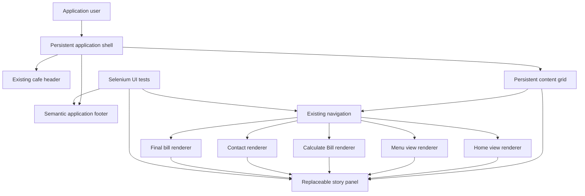
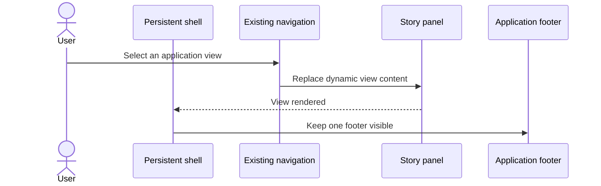

# System Architecture: US-006

## 1. Source and Summary
- User story reference: US-006, Addition of Footer Message at the bottom of the Application Pages
- Source requirement analysis document: `UserStories/US-006/US-006-RequirementAnalysis.md`
- Solution summary: Add one persistent semantic footer banner to the existing application shell so the exact cafe rights message remains visible while client-side views replace only the story panel.
- Actors and stakeholders: Cafe application users, cafe operators, application maintainers, and Selenium test maintainers.
- Architecture objective: Satisfy the footer presentation requirement with minimal static HTML/CSS changes, preserve existing navigation and dynamic views, and avoid unnecessary backend, database, or runtime dependencies.

## 2. Scope

### In scope
- Add one semantic footer after the persistent content grid.
- Display the exact message `All the rights reserved for the cafe to the management.`.
- Center the message and style it italic using the regular application font.
- Reuse existing theme colors and design conventions for the banner.
- Keep the footer visible while Home, Menu, Calculate Bill, Contact, and final bill contents are rendered.
- Add stable Selenium selectors and focused cross-view/responsive assertions.

### Out of scope
- C# endpoint, service, model, middleware, authentication, or authorization changes.
- SQL schema, query, migration, seed-data, or persistence changes.
- Loading the footer text from an API or database.
- Fixed/sticky viewport positioning unless a later requirement explicitly requests it.
- Changes to existing application navigation, dynamic renderers, bill calculations, or contact content.
- Defining browser print behavior until the open print-scope question is resolved.

### Assumptions and constraints
- The existing `page-shell` contains the complete application experience and is not replaced during client-side navigation.
- Existing renderers replace only `.story-panel`; the footer will be a sibling after `.content-grid`.
- The footer is a child of the persistent application shell and remains present during all existing `.story-panel` success and error states.
- A document-flow footer is the conservative interpretation of “at the bottom” because it cannot cover controls.
- Existing CSS variables and the `DM Sans` regular font are the approved visual foundation.
- The current 700-pixel media-query breakpoint is the narrow-layout boundary for testing.

## 3. High-Level Architecture

### Architectural style
Retain the existing .NET-hosted static single-page shell with lightweight TypeScript view rendering. The footer is a static presentation component and requires no new framework or dependency.

### Presentation layer
- `wwwroot/index.html` owns the persistent page shell and semantic footer markup.
- `wwwroot/styles.css` owns footer banner layout, alignment, typography, theme, and responsive behavior.
- `src/main.ts` remains unchanged unless a later implementation finding requires a selector or render-boundary adjustment.
- `wwwroot/main.js` remains unchanged because the footer is outside dynamic view rendering.

### Application/service layer
No changes. Existing client-side renderers continue to replace `.story-panel` only.

### Data access layer
No changes. The footer contains no dynamic data.

### Database layer
No changes. The footer text is not persisted business data.

### External integrations
No new integration. Existing external social links remain unchanged, and the removed/absent location integration is unrelated to this story.

## 4. Component Diagram

### Component responsibilities
- **Persistent application shell:** Keeps header, navigation/content grid, and footer in the document while views change.
- **Semantic application footer:** Displays the static rights message exactly once and has no interactive semantics or event handlers.
- **Footer styles:** Apply centered alignment, italic regular font, theme-compatible banner treatment, and responsive spacing.
- **Story panel renderers:** Continue replacing only dynamic content and must not create or remove footer instances. The footer must not be added to any dynamic renderer string.
- **Selenium layer:** Verifies footer text, presentation, non-clickability, persistence, and responsive layout.

## 5. Data Flow

### Initial page flow
1. The browser loads the persistent HTML shell.
2. The shell renders the header, navigation/content grid, and one footer banner.
3. Existing TypeScript loads the active cafe story into `.story-panel`.
4. The footer remains outside the story-panel update boundary.

### Client-side view flow
1. The user selects an existing navigation control.
2. The relevant renderer replaces `.story-panel.innerHTML`.
3. The persistent footer remains in the DOM, visible after the content grid.
4. The persistent footer remains visible for successful views and their existing loading or error states.
5. No footer request, state update, event handler, or database operation occurs.

### Persistence flow
None. The footer is static markup and has no persistence requirement.

### Error and exception flow
- Footer rendering has no network or database failure path.
- If an existing dynamic view fails, the footer remains visible because it is outside the replaceable panel.
- Existing view-specific error states remain unchanged.

### Approval/validation flow
Static markup and computed-style Selenium assertions verify exact text, semantic non-interactivity, visual presentation, cross-view persistence, and responsive geometry.

## 6. C# Backend Design

### Controllers and endpoints
No changes. No endpoint is needed for static footer content.

### Service responsibilities and domain logic
No changes. Footer content is not domain logic.

### DTOs and request-response models
No changes.

### Validation and error handling
No server-side validation or error handling is required.

### Authentication and authorization implications
None. The footer is public static presentation content.

### Logging and observability
No changes. There is no footer operation to log.

## 7. SQL Database Design

### Tables and entities
No changes.

### Relationships, keys, constraints, and indexes
No changes.

### Transactions and concurrency
Not applicable. No writes or reads are introduced.

### Audit and history requirements
Not applicable. The footer creates no business event or persisted state.

## 8. Selenium UI Testing Design

### Test coverage scope
- Verify one semantic footer exists on the initial Home view.
- Verify exact text, centered alignment, italic computed style, and regular font family.
- Verify the footer is not an anchor, button, form control, or keyboard-focusable element.
- Verify the footer remains present exactly once after every current client-side view transition.
- Verify existing navigation remains functional with the footer present.
- Verify footer bounds and readability at desktop and at or below the 700-pixel breakpoint.
- Verify the footer remains present during existing dynamic-view loading and error states where those states can be deterministically produced.

### Critical user journeys
1. Load Home and inspect the footer.
2. Navigate to Menu, Calculate Bill, and Contact; inspect the same footer after each transition.
3. Inspect the footer on final bill only when deterministic existing bill setup is available.
4. Navigate repeatedly and confirm no duplicate footer is introduced.

### Positive, negative, and boundary scenarios
- Positive: Exact message is visible and centered on Home and dynamic views.
- Positive: Computed font style is italic and font family is the existing regular font.
- Negative: Footer contains no anchor, button, form control, or click behavior.
- Boundary: At 700 pixels or below, message remains within the viewport and does not overlap content.
- Boundary: Short and expanded dynamic views both retain one footer in document flow.
- Conditional: Final-bill coverage is executed only when deterministic bill setup exists; otherwise it is recorded as unexecuted.
- Print: Defer pass/fail expectations until inclusion in print output is confirmed.

### Test data needs
- No new data is required for Home, Menu, or Contact footer checks.
- Existing menu/bill data is required only if final-bill coverage is included.

### Selector and testability considerations
- Add `data-testid="application-footer"` to the semantic `<footer>`.
- Use `FindElements` to assert exactly one visible `[data-testid="application-footer"]` and to inspect absence of interactive descendants.
- Assert the footer text exactly, including capitalization and final punctuation.
- Assert that the footer has no anchor, button, input, select, textarea, or form descendants and is not included in the keyboard tab order.
- Use JavaScript computed styles for `font-style`, `font-family`, and text geometry.
- Use `getBoundingClientRect()` to verify horizontal centering, footer placement at or after `.content-grid` bottom, and no overlap with content.
- At the 700-pixel breakpoint, assert footer right edge is within `window.innerWidth` and its scroll width does not exceed its client width.
- Avoid testing banner appearance through brittle pixel colors; assert theme-token-derived computed values only if necessary.

### Cross-browser and execution considerations
The existing suite uses headless Chrome. Cross-browser execution is not required by US-006 and remains a future quality enhancement.

## 9. Non-Functional Considerations
- Use semantic `<footer>` markup and ordinary text content.
- Avoid `href`, `tabindex`, click listeners, or button semantics on the message.
- Keep the footer outside dynamic panel rendering to ensure one-instance persistence.
- Preserve current CSS custom properties, typography, and responsive breakpoint.
- Use document flow and sufficient spacing to avoid overlap or content obstruction.
- Introduce no runtime dependency, API call, database read, or server-side state.

## 10. Risks, Dependencies, and Open Questions

### Confirmed facts
- The current application shell contains a persistent `page-shell` and `content-grid`.
- Dynamic views replace only `.story-panel`.
- Existing regular text font is `DM Sans`; `Pacifico` is used for decorative branding/headings.
- Existing theme colors are exposed through CSS custom properties.
- The story requires the exact message, centered placement, italic regular font styling, existing design, and non-clickability.

### Assumptions
- Placing the footer after `.content-grid` makes it the bottom section of every current application view.
- A static footer should not be duplicated in TypeScript renderer strings.
- Existing page padding and responsive rules can accommodate a small footer banner with only focused CSS additions.
- A stable `application-footer` test identifier is acceptable and does not expose business data.

### Dependencies
- Existing `index.html` shell and `styles.css` theme variables.
- Existing dynamic renderers continuing to own only `.story-panel`.
- Selenium with a running application for cross-view and responsive evidence.
- Existing deterministic menu/bill data if final-bill coverage is required.
- Deterministic error-state setup if loading/error-state footer persistence is to be claimed as executed evidence.

### Unresolved questions
- Should the footer appear in browser print output and final bill print output?
- Should “bottom” mean document-flow bottom only, or should short pages pin the footer to the viewport bottom?
- What exact background, border, minimum height, and spacing should the banner use beyond existing theme conventions?
- Does “all pages” include future routes and error pages that do not yet exist?
- If deterministic error-state setup is unavailable, those states remain specified requirements but cannot be claimed as tested.

## 11. Traceability Matrix

| Source requirement | UI components | C# backend | SQL objects | Selenium coverage |
|---|---|---|---|---|
| FR-001, FR-002; AC-001, AC-002 | Persistent semantic footer in `index.html` | No change | No change | Exact text and cross-view visibility |
| FR-003, FR-004, FR-005; AC-003 through AC-005 | Footer CSS and document-flow placement | No change | No change | Position at/after content bottom, centering, italic style, regular font |
| FR-006, FR-008; AC-006, AC-008, AC-009 | Existing theme variables, shell, and dynamic panel boundary | Existing APIs unchanged | Existing data unchanged | Existing navigation and responsive layout |
| FR-007; AC-007, AC-010 | Non-interactive `<footer>` text outside renderer strings | No change | No change | Interactive-descendant, tab-order, and one-instance checks |
| NFR-001 through NFR-006 | Semantic markup, persistent shell, CSS | No change | No change | Accessibility, one-instance, responsive, and runtime dependency checks |

## 12. Acceptance Mapping
- The persistent semantic footer directly satisfies the exact-message and all-current-views requirements without duplication.
- CSS applies centered, italic `DM Sans` styling and reuses existing theme values.
- Document-flow placement keeps the footer after the content and avoids covering controls.
- Static text without interactive descendants satisfies the non-clickability requirement.
- Keeping the footer outside `.story-panel` preserves all existing client-side view behavior.
- Selenium selectors, DOM checks, geometry, and computed-style assertions provide evidence for content, presentation, persistence, accessibility, and responsive behavior.
- Final-bill and error-state evidence remains conditional on deterministic setup; unexecuted scenarios must be reported as such.
- Print inclusion and viewport-pinning semantics remain explicitly unresolved and must not be claimed as implemented until confirmed.