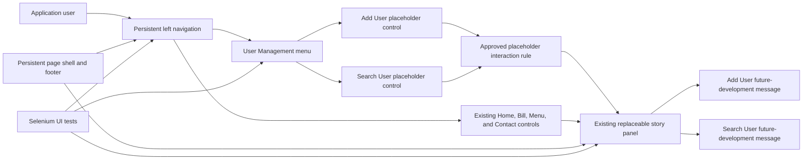
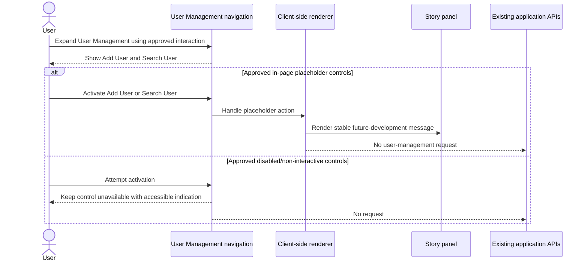

# System Architecture: US-007

## 1. Source and Summary
- **User story reference:** US-007, Addition of User Management Menu on the application pages.
- **Source requirement analysis document:** `UserStories/US-007/US-007-RequirementAnalysis.md`.
- **Solution summary:** Add a persistent User Management entry to the existing left navigation and expose Add User and Search User placeholder states in the existing client-rendered story panel. The feature introduces presentation behavior only; user-management workflows, APIs, persistence, and authentication changes remain out of scope.
- **Actors and stakeholders:** Application users who can view the application pages, the Cafe Management product team, the product owner/design reviewer resolving placeholder interaction semantics, application maintainers, and Selenium test maintainers.
- **Architecture objective:** Extend the existing .NET-hosted single-page shell with minimal client-side navigation changes, preserve every existing view and the footer/page shell, prevent unsupported requests or broken routes, and make the unresolved clickable/non-clickable requirement explicit and testable before implementation.
- **Approved interaction decisions:** User Management expands and collapses from an in-page button activation, including native keyboard activation. Add User and Search User are in-page controls, not navigable links. Their exact messages are `Add User is reserved for future development.` and `Search User is reserved for future development.` respectively.

## 2. Scope

### In scope
- Display the exact `User Management` label in the persistent left navigation on all existing application views.
- Expose exactly the `Add User` and `Search User` submenu labels.
- Render a clear future-development message for each placeholder in the existing right-side content panel according to the interaction rule approved by the product owner/design reviewer.
- Keep the application shell, footer, existing navigation, theme, color scheme, typography, and responsive behavior intact.
- Ensure placeholder interactions remain client-rendered, do not navigate to unsupported routes, do not call user-management APIs, and do not persist data.
- Add stable Selenium selectors and focused coverage for visibility, submenu state, placeholder behavior, non-broken navigation, accessibility, and the narrow viewport.

### Out of scope
- Add User or Search User workflows, forms, results, validation, or user-record management.
- C# user-management controllers, endpoints, services, domain models, DTOs, authentication, authorization, or role rules.
- SQL tables, columns, relationships, indexes, migrations, seed data, transactions, or audit records for users.
- User-management API calls, network requests, persistence, or external integrations.
- A new client-side routing framework, deep-link contract, URL/hash contract, or browser-history behavior unless separately approved.
- Changes to Home, Calculate Bill, Add/Remove Cafe Menu, Reach Us At, bill calculation, menu management, contact content, or footer behavior beyond preserving them with the new navigation present.

### Assumptions and constraints
- The existing `page-shell` and left navigation are persistent; current renderers replace only `.story-panel`.
- The existing navigation interaction pattern is the implementation baseline, but the exact User Management expansion interaction is unresolved in the source analysis.
- The exact wording of each future-development message is unresolved and must be confirmed before implementation.
- The current 700-pixel media-query breakpoint is the narrow-layout boundary used by the existing UI tests.
- Existing `data-testid` selectors are the accepted testability convention.
- “Not clickable” is interpreted as “not a real navigable user-management link”: the approved controls may be activated only to render their in-page placeholder messages.
- The existing Selenium home-page assertion expects exactly four navigation anchors. User Management and its submenu controls must therefore be buttons or equivalent non-anchor controls and must not increase that anchor count.

## 3. High-Level Architecture

### Architectural style
Retain the existing .NET-hosted static single-page application with a persistent HTML shell and lightweight TypeScript-driven client rendering. Add no router, framework, runtime dependency, backend contract, or database object for this placeholder story.

### Presentation layer
- `src/CafeManagement/wwwroot/index.html` owns the persistent navigation markup, User Management menu structure, initial shell, and initial content panel.
- `src/CafeManagement/src/main.ts` owns the User Management expansion and placeholder view event handling, following the existing renderer pattern. The compiled `wwwroot/main.js` is the browser artifact produced by the existing TypeScript build and must remain synchronized with the source.
- `src/CafeManagement/wwwroot/styles.css` owns submenu layout, placeholder presentation, focus/disabled treatment selected by the approved interaction rule, and responsive behavior while reusing the existing design tokens.
- The footer remains outside `.story-panel` so it remains present exactly once across placeholder and existing views.

### Application/service layer
No new application or service layer is required. Placeholder rendering is a presentation concern and must not call a nonexistent user-management endpoint.

### Data access layer
No changes. Existing data access for Home, menu, and bill features remains available to their existing views.

### Database layer
No changes. US-007 has no persisted user-management data.

### External integrations
No new integrations. Placeholder activation must not issue requests to unsupported user-management resources.

## 4. Component Diagram

### Component responsibilities
- **Persistent page shell:** Keeps header, navigation/content grid, story panel, and footer in the document while views change.
- **User Management navigation group:** Displays the exact top-level label and the two required submenu labels. A button click or native keyboard activation toggles the submenu and updates an observable `aria-expanded`/`aria-controls` state.
- **Placeholder controls:** Add User and Search User are in-page buttons, not anchors. Activation renders only the approved message without navigation or network activity; this is the approved interpretation of “not clickable.”
- **Placeholder renderers:** Replace only `.story-panel` content with a stable heading/message and do not create a route, submit data, or call an API.
- **Existing renderers:** Continue to own Home, Calculate Bill, Add/Remove Cafe Menu, and Reach Us At views without losing their persistent navigation access.
- **Selenium layer:** Verifies exact labels, observable expansion state, the approved interaction semantics, stable placeholder content, cross-view persistence, and responsive layout.

## 5. Data Flow

### Initial page flow
1. The browser loads the existing static application shell.
2. The persistent navigation contains a User Management button and its Add User/Search User submenu structure. The submenu is collapsed initially and toggles on button click or native keyboard activation.
3. The existing client script attaches event handling to persistent navigation controls.
4. The initial Home view loads through the existing cafe-story behavior.
5. The footer and navigation remain outside the dynamic panel update boundary.

### User Management expansion flow
1. The user clicks or keyboard-activates the User Management button.
2. The client updates only the observable submenu state, such as visibility and an appropriate accessible state attribute.
3. The submenu exposes exactly `Add User` and `Search User` and no additional user-management entries.
4. No backend request or database operation occurs.

### Placeholder activation flow
1. The user activates the Add User or Search User in-page button.
2. The client replaces `.story-panel` with the corresponding approved future-development message and stable test identifier.
4. No URL navigation, unsupported endpoint request, form submission, persistence, or user-management state change occurs.
5. The persistent navigation, footer, and application shell remain intact.

### Response and persistence flow
There is no server response or persistence flow for US-007. Existing APIs continue to serve existing features only. Placeholder state is transient client-side presentation state.

### Error and exception flow
- Placeholder activation must not produce an HTTP 404, route failure, unhandled JavaScript exception, or expected-error logging caused by an unsupported request.
- **Risk:** The repository has no evidenced generic client-side error boundary or placeholder-renderer fallback. A future implementation failure could therefore leave the panel in an unexpected state; implementation and focused US-007 tests should assess whether a minimal local fallback is needed without expanding this story into a general error-handling design.
- Existing Home, menu, bill, contact, and footer behavior remains governed by their current error and rendering paths.
- Async operations from existing views must not overwrite a later placeholder view; the existing view-scoped rendering pattern remains the boundary for any applicable requests.

### Approval and validation flow
The approved rule is the in-page placeholder interpretation: User Management toggles on button activation; Add User and Search User are activatable non-anchor controls; and activation renders exactly `Add User is reserved for future development.` or `Search User is reserved for future development.` in `.story-panel`. No URL navigation, user-management API call, form submission, or persistence is allowed. The implementation plan and Selenium tests must use this rule consistently.

## 6. C# Backend Design

### Controllers and endpoints
No new controller or endpoint is required. Existing controllers/endpoints for cafe story, menu, and bill features remain unchanged.

### Service responsibilities and domain logic
No user-management service, domain logic, or business operation is introduced. Rendering a future-development message remains a client-side presentation responsibility.

### DTOs and request-response models
No new request or response models are required.

### Validation and error handling
No server-side validation is required for placeholders because no user input or request is accepted. The client must avoid requests to missing user-management endpoints and must keep the existing page shell stable.

### Authentication and authorization implications
None are defined by the source. Do not add roles, permissions, login behavior, account rules, or authorization checks for US-007.

### Logging and observability
No new backend logging or metrics are required. The client must not generate expected-error noise by requesting unsupported user-management resources.

## 7. SQL Database Design

### Tables and entities
No new tables or entities. US-007 does not create, read, update, or delete user records.

### Relationships, keys, constraints, and indexes
No changes.

### Transactions and concurrency
Not applicable. No database reads or writes are introduced.

### Audit and history requirements
No audit or history record is required because placeholder interactions do not change business data.

## 8. Selenium UI Testing Design

### Test coverage scope
- Verify `User Management` is visible on the initial page and after each existing view transition.
- Verify the submenu exposes exactly `Add User` and `Search User` after the approved expansion interaction.
- Verify User Management expands and collapses by click and native keyboard activation, with an observable `aria-expanded`/`aria-controls` state.
- Verify the submenu expansion state through an observable DOM/accessibility state rather than timing or CSS-only assumptions.
- Verify the approved in-page, non-anchor interaction semantics.
- Verify Add User and Search User placeholder messages and stable content selectors when the approved behavior is the in-page interpretation.
- Verify the exact approved messages: `Add User is reserved for future development.` and `Search User is reserved for future development.`
- Verify no unsupported user-management request or broken route occurs during placeholder interaction.
- Preserve the existing home-page assertion that `[data-testid='navigation'] a` contains exactly four anchors; User Management and its submenu controls must not alter this count.
- Verify Home, Calculate Bill, Add/Remove Cafe Menu, and Reach Us At remain usable after placeholder views.
- Verify the footer and application shell remain intact and there is no duplicate shell or duplicate footer.
- Verify labels, controls, and message content remain within the viewport at the existing narrow responsive test size.
- Run `npm run build` from `src/CafeManagement` and verify the generated `wwwroot/main.js` is synchronized with the TypeScript source before Selenium execution.

### Critical user journeys
1. Load the application and confirm User Management is visible alongside existing navigation.
2. Expand User Management using the approved interaction and confirm exactly Add User and Search User are exposed.
3. Apply the approved Add User interaction and verify the expected placeholder semantics and message.
4. Apply the approved Search User interaction and verify the expected placeholder semantics and message.
5. Return to Home and each existing navigation view after placeholder interaction and confirm normal rendering.
6. Repeat expansion and placeholder transitions to detect duplicate event handlers, stale content, or unusable navigation.

### Positive, negative, and boundary scenarios
- Positive: Exact top-level and submenu labels are visible and stable.
- Positive: Each approved placeholder behavior is rendered within the existing story panel and shell.
- Negative: No placeholder control navigates to a nonexistent route, submits data, calls a user-management API, or persists a record.
- Negative: No application error state, duplicate shell, stale placeholder, or unhandled client error remains after returning to an existing view.
- Accessibility: The selected control semantics are keyboard-operable and communicated through native semantics or the approved accessible state/label.
- Boundary: At 700 pixels or below, navigation and submenu labels remain visible, fit within the viewport, do not overlap the story panel, and preserve the stacked responsive layout.
- Conditional: If the selected behavior depends on a product decision that remains unresolved, UI-006 and placeholder activation tests are blocked and must be reported as unexecuted rather than inferred as passing.

### Test data needs
- No new database or API test data is needed for the placeholders.
- Existing deterministic cafe-story, menu, and bill data is needed only for regression checks of the existing views.
- Network inspection or a deterministic request spy may be used to demonstrate that placeholder activation makes no unsupported request, subject to the existing test harness capabilities.

### Selector and testability considerations
Use stable selectors consistent with the existing suite:

- `data-testid="nav-user-management"` for the top-level menu control.
- `data-testid="user-management-submenu"` for the submenu container.
- `data-testid="nav-add-user"` for Add User.
- `data-testid="nav-search-user"` for Search User.
- `data-testid="add-user-placeholder"` and `data-testid="search-user-placeholder"` for the rendered placeholder regions or headings.
- Use an observable `aria-expanded`/`aria-controls` state or equivalent DOM state for expansion.
- Assert exact visible labels and use `FindElements` where absence or uniqueness matters.
- For the approved in-page semantics, assert the controls are non-anchor in-page controls, assert no navigation URL change or API request, and assert the exact expected message inside `.story-panel`.
- Use geometry checks for the narrow viewport and verify the persistent footer remains present exactly once.

### Cross-browser and execution considerations
The existing suite uses NUnit, Selenium WebDriver, headless Chrome, and `CAFE_BASE_URL`. Chrome is the currently evidenced browser. Cross-browser execution is not required by the source story and remains a future quality enhancement.

## 9. Non-Functional Considerations

- Preserve existing theme tokens, typography, spacing, focus treatment, and side-panel responsive layout.
- Keep all new UI within the persistent shell and the existing client-rendered panel boundary.
- Use semantic, accessible control semantics appropriate to the approved interaction rule.
- Avoid unsupported network calls, expected-error logging, URL contracts, and persistence.
- Keep selectors stable and independent of DOM order or presentation-only class names.
- Do not claim the conflict is resolved until the product owner/design reviewer has selected and documented one interaction rule.

## 10. Risks, Dependencies, and Open Questions

### Confirmed facts
- US-007 requires exact visible labels `User Management`, `Add User`, and `Search User`.
- Add User and Search User are future-development placeholders; actual user management is out of scope.
- The existing application uses a persistent left navigation and a right-side client-rendered content panel.
- Current UI rendering is in `src/CafeManagement/wwwroot/main.js`, with TypeScript source under `src/CafeManagement/src` and styles in `src/CafeManagement/wwwroot/styles.css`.
- Existing Selenium tests use NUnit, Selenium WebDriver, Chrome, `CAFE_BASE_URL`, and `data-testid` selectors.
- No user-management API, model, service, database table, or Selenium coverage exists in the current solution.
- The existing `HomePageShowsRequiredCafeContent` test asserts exactly four anchors under the navigation, so the new User Management controls must not be implemented as additional navigation anchors.
- `src/CafeManagement/package.json` defines `npm run build` as `tsc`; `tsconfig.json` emits TypeScript from `src/**/*.ts` into `wwwroot`.

### Assumptions
- The current navigation and story-panel boundary are sufficient to host User Management placeholders without adopting a router.
- Existing footer and shell behavior should persist across the new client-rendered placeholder views.
- Stable `data-testid` attributes are acceptable testability hooks.
- The approved placeholder messages are static client-side content with the exact wording recorded in this document.

### Dependencies
- Existing `index.html`, `main.ts`/compiled `main.js`, and `styles.css` navigation and rendering conventions.
- Existing application shell and view renderers remaining persistent and responsive.
- Approved product/design decisions: click or native keyboard activation expands User Management; Add User and Search User are in-page non-anchor controls; exact placeholder messages are recorded in this document.
- TypeScript build output remains synchronized with `main.ts` before browser tests run.
- Running application, ChromeDriver, and the configured base URL for executable Selenium verification.

### Open questions
1. Should placeholder state remain client-rendered only, or have an approved URL/hash representation? US-007 currently keeps it client-rendered only.
2. Does “all application pages” include only the existing views or future pages introduced later?
3. Should implementation add a minimal local fallback for unexpected placeholder-renderer failure, or accept the documented risk?

## 11. Traceability Matrix

| Source requirement / acceptance criterion | UI components | C# backend | SQL objects | Selenium coverage |
|---|---|---|---|---|
| FR-001, BR-001, BR-005, BR-006, AC-001, AC-006 | Persistent User Management navigation item in `index.html`; existing side-panel styles | No change | None | UI-001, UI-002, UI-008 |
| FR-002, BR-002, BR-009, AC-002 | User Management submenu and observable expansion state | No change | None | UI-003, UI-006 |
| FR-003, BR-003, BR-008, AC-003 | Add User placeholder renderer and stable placeholder selector in `.story-panel` | No endpoint | None | UI-004, UI-007 |
| FR-004, BR-003, BR-008, AC-004 | Search User placeholder renderer and stable placeholder selector in `.story-panel` | No endpoint | None | UI-005, UI-007 |
| FR-005, BR-004, BR-011, AC-005, AC-008 | Persistent shell, guarded client rendering, existing navigation and footer boundary | Existing APIs unchanged; no user-management request | Existing data unchanged | UI-004, UI-005, UI-007, UI-008 |
| FR-006, BR-007, BR-012, AC-007 | In-page non-anchor placeholder controls; no unsupported route, API call, or persistence | No navigation contract | None | UI-006 plus exact approved-message assertions |
| NFR-001, NFR-002 | Existing theme, shell, responsive styles, controlled client state | No change | None | UI-002, UI-007, UI-008 |
| NFR-003, NFR-004 | Stable `data-testid` hooks and semantic/accessibility state | No change | None | UI-003 through UI-008 |

## 12. Acceptance Mapping

- AC-001 and AC-006 are supported by adding User Management to the persistent navigation and reusing the existing visual language.
- AC-002 is supported by a submenu containing exactly Add User and Search User with an observable expansion state.
- AC-003 and AC-004 are supported by client-rendered placeholder regions in the existing story panel using the approved in-page controls and exact messages.
- AC-005 and AC-008 are supported by keeping navigation and the footer outside the dynamic panel boundary and forbidding unsupported routes or API calls.
- AC-007 is resolved by the approved interpretation that the controls are not real navigable links: they are in-page controls that render only the approved messages.
- No backend or SQL acceptance criteria are supported by the source, so no backend or database changes are architecturally required.
- Final acceptance remains conditional on executable evidence: focused US-007 tests, the existing four-anchor regression assertion, narrow-viewport checks, and successful TypeScript build/generated-artifact synchronization.
